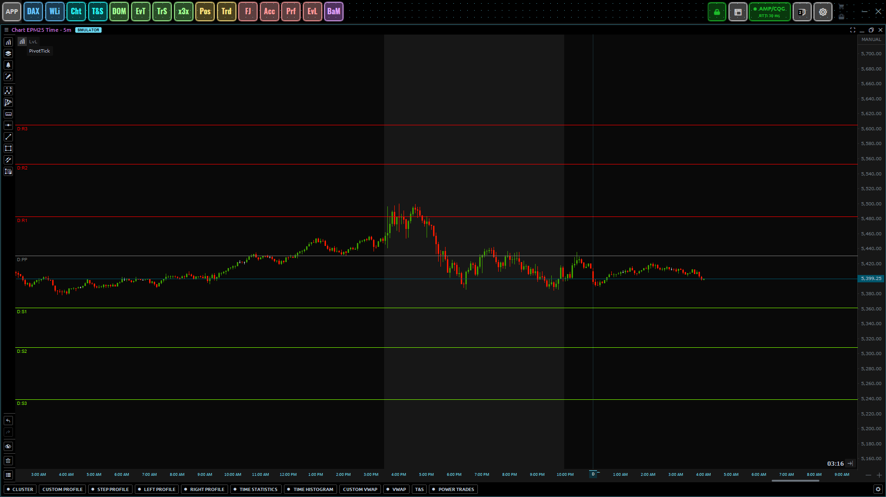

# Pivot Point Tick (Temporary solution)

- License: **[GPL-3.0 License](./license.txt)**

Welcome to the `Pivot Point Tick Indicator` project! 
  This temporary solution enables the display of pivot points on tick charts 
  in Quantower. The platform’s native pivot point indicator does not currently 
  support tick charts properly due to its internal implementation.

A pivot point is a technical indicator used to identify potential support and 
  resistance levels based on the previous session's high, low, and close.  

## Download And Install

> [!CAUTION]
> By using this indicator, you acknowledge and agree that **you do so at your own risk**.
> The indicator is intended purely for educational and informational purposes.
>
> **I, the creator, take no responsibility** for any losses or damages (direct, indirect, 
> consequential, or otherwise) that may result from using this indicator in any live 
> trading environment.
>
> - Ensure to test the indicator in a safe and controlled environment 
>   before using it in actual trading.
> - Always verify the behavior of the indicator with backtesting, paper 
>   trading, or in simulation mode.
> - This tool does not guarantee profitable trading outcomes and is not a 
>   substitute for professional financial advice or risk management strategies.
>
> By continuing to use this tool, you acknowledge that you have read, understood, and agree to these terms.

<a
    class="button button--primary"
    href="https://github.com/qtx-project/indicator-pivot-tick/releases/latest/download/indicator.zip"
    download
    target="_blank"
    rel="noopener noreferrer">Download the Latest Release</a>
    
### 1. Extract the ZIP File

Once the `indicator.zip` file is downloaded, open it and extract the 
`PivotTick` folder.

### 2. Move the indicator to the Appropriate Folder

Move the extracted `PivotTick` folder into your Quantower 
**indicators directory**. This is typically located at `Quantower/Settings/Indicators/..`

### 3. Restart Quantower

After moving the indicator, restart Quantower to apply the changes and
add the indicator to your chart.
